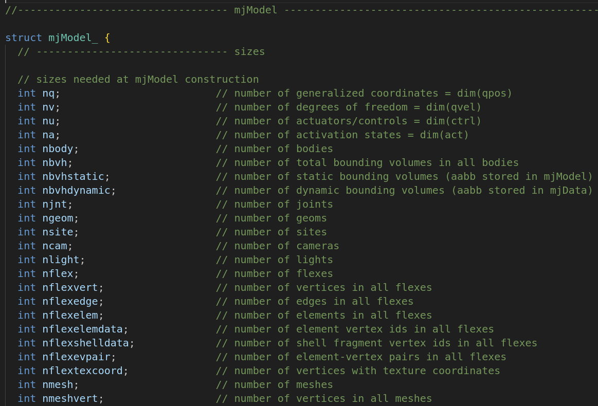
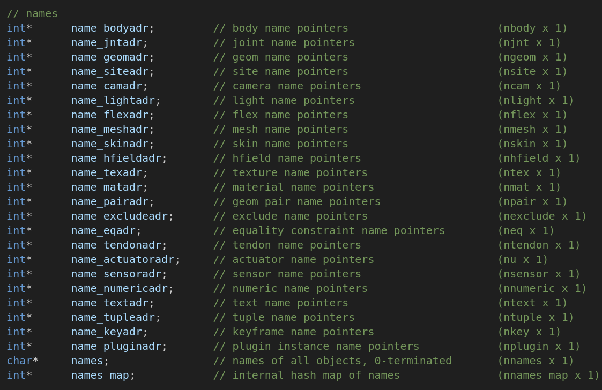
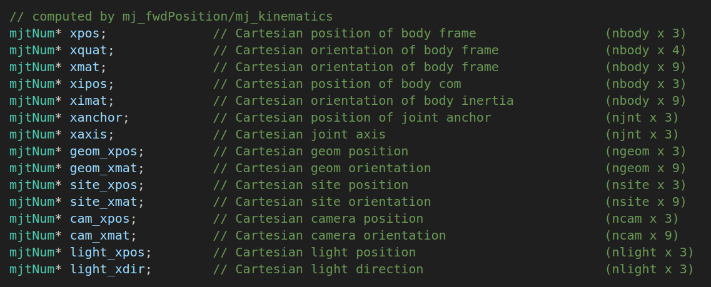

# get obj
## 获取名字
数量

**先看mjModel结构体开头部分，这里的命名方式都是nXXX，这代表各个元素的数量**

## 获取id
`MJAPI int mj_name2id(const mjModel* m, int type, const char* name);`
**通过name获取实体的id          
m :mjModel
type:   mjmodel.h文件中的mjtObj中定义，这个是要获取id的实体类型一下是部分type类型枚举，在mjtObj中找到       
name: name
**     

## 获取位置

**可以通过 xpos和xxx_xpos获取各个对象的位置**
## 获取姿态
**通过xquat可以获取body的姿态**

