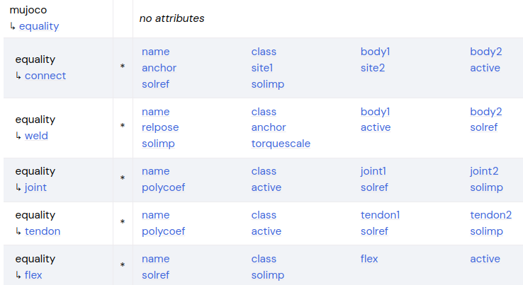

# 闭链
&emsp;&emsp;在机器人设计中有时候会出现并联连杆结构，但是常规的建模方式没办法形成闭环，在urdf中我们没办法实现并联连杆，但是mujoco中提供了一种连接方式。

&emsp;&emsp;mujoco节点下的equality节点可以实现这一功能，它可以将两个物体连接到一起。
&emsp;&emsp;connect和weld中body1和body2是要连接的两个body
* anchor是在body1的坐标系中的两个body连接位置。
* site 作为连接点
  &emsp;&emsp;connect是点对点连接，自由度和球形关节一样，连接只限制了物体之间的距离。weld是刚性连接，自由度是锁死的，可以通过torquescale来调节连接强度（阻尼）。

  joint和tendon是使用四次多项式让joint1/tendon1的数据跟踪joint2/tendon2的数据
  y - y0 = a0 + a1(x-x0) + a2(x-x0)^2 + a3(x-x0)^3 + a3(x-x0)^4
* y为joint1/tendon1的数据
* y0为joint1/tendon1的参考数据（初始值）
* x为joint2/tendon2的数据
* x0为joint2/tendon2的参考数据（初始值）