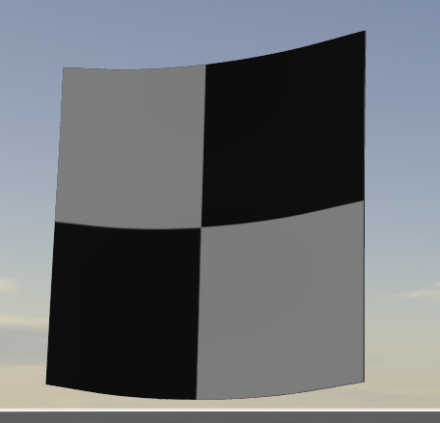

# composite 复合体 (3.2.7及以前版本)

&emsp;&emsp;复合体可以仿真，body集合，软体，布料，鱼网等。本质上是一堆微小几何体组合形成的新型结构。        
**prefix="name"**       
&emsp;&emsp;和name相同也就是names，prefix表示整个复合体的命名索引，具体复合体中的body名称为name+B+（坐标），比如坐标为（1,2）那body的name就是nameB1_2）     
**type=[particle,grid,cable（代替后两个）,rope（弃用）,loop（弃用）,cloth（弃用，使用 grid代替布料）,box,cylinder,ellipsoid]**      
&emsp;&emsp;particle粒子集合        
&emsp;&emsp;grid网格 1 D或者 2 D，也代替布料，绳子      
&emsp;&emsp;box立方体集合，可以做成软体立方体。         
**count=" 000 "**       
&emsp;&emsp;复合体的排列数量和方式，分别对应三个方向上的数量）      **spacing=""**      
&emsp;&emsp;复合体排列中，两个小 body之间距离       
**offset=" 000 "**      
&emsp;&emsp;相当于整个复合体的空间坐标      
**joint=[main,twist,stretch,particle]**     
&emsp;&emsp;复合体活动类型      
**pin-coord=""**        
&emsp;&emsp;复合体固定位置      
<font color=Green>*演示：*</font>
**1. 粒子集合**
```xml
<composite type="particle" prefix="bullet" count="5 5 10" spacing="0.01" offset="1 1 2">
<geom type="sphere" size="0.0084" material="green_grapes" mass="0.0032" />
<joint kind="particle" type="free" />
</composite>
```
&emsp;&emsp;这里是创建了一个 5 * 5 * 10 的小弹丸集合，命名为 bullet，joint添加 particle是给粒
子用的，free就是代表可以自由碰撞。
**2. 绳**
```xml
<composite type="grid" prefix="C" count="10 1 1" spacing="0.1" offset="1 1 2">
<geom type="sphere" size="0.0084" material="green_grapes" mass="0.0032" />
<joint kind="twist" type="free" />
</composite>
```
&emsp;&emsp;这里可以使用 grid，这是给 1 D和 2 D集合体使用的，可以仿真一节一节类似线的集合。
注意这里 1 D的仿真的 count。joint的 twist是给这类复合体使用的，也可以不加入
joint。

**3. 悬挂鱼网**
```xml
<composite type="grid" prefix="C" count="10 10 1" spacing="0.1" offset="1 1 2">
<geom type="sphere" size="0.0084" material="green_grapes" />
<pin coord="0 0"/>
<pin coord="0 9"/>
<joint kind="twist" type="free" />
</composite>
```
&emsp;&emsp;这里我们还是使用 grid，创造了一个 10 * 10 的网，网格间距为 0. 1 ,通过 pin的作用是
固定网面上的( 0 , 0 )和( 0 , 9 )点让网悬挂起来。

**4. 布料**
```xml
<composite type="grid" count="5 5 1" spacing="0.6" offset="0 0 3">
<skin texcoord="true" material="plane" inflate="0.01" subgrid="3" />
<pin coord="0 0" />
<pin coord="4 0" />
<geom size="0.1" />
<joint kind="main" damping="5" />
</composite>
```
&emsp;&emsp;这里仍然使用的是 grid，但是加入了 skin，这可以使整个网的表面联合起来，形成布料
的效果，这里的 count和 spacing会影响布的“密度”，密度越大越不容易活动。
skin中texcoord是影响纹理可视化的，inflate类似厚度，负值可以直接穿过布料。正
值表示布料比较厚，对于碰撞影响较大。subgrid越高渲染等级越高，建议不要大于 3 。
