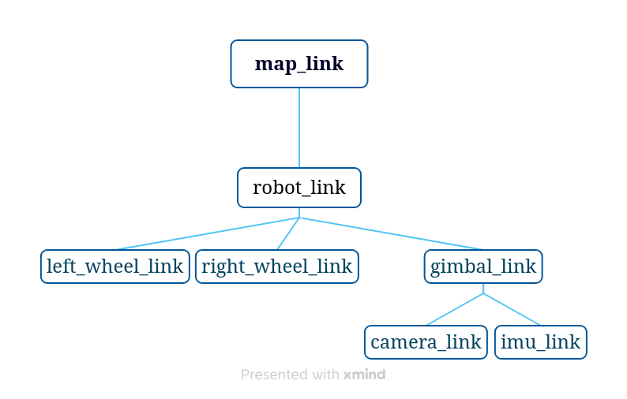

# worldbody

## geom

* type="[plane/hfield/sphere/capsule/ellipsoid/cylinder/box/mesh/sdf]
*   size="0 0 0"（三个参数根据type选择填写）
*   pos="0 0 0"（位置）
*   condim="[1/3/4/6]"（见下表）
*   priority="0"（碰撞优先级）
*   material="xxx"（材质名）
*   rgba="0 0 0 0"（几何体颜色，比材质省资源）
*   friction="1 0.005 0.0001"（滑动，扭矩，滚动摩擦系数）
*   mass（质量，单位kg，它和密度只能有一个），density="0"（密度，单位kg/m³，它和质量拼了）
*   shellinertia=[true/false]（开了就是质量集中在边缘，关了就是均匀密度）
*   fromto="0 0 0 0 0 0"（类似旋转通常代替旋转+长度，只能用于胶囊、盒子、圆柱体和椭球体，前三个是point1，后三个point2，几何体的Z轴正方向为point2->point1）

|type	|size参数量|	描述|
|---|---|---|
|plane|	3|	X 半长;Y半长;渲染时网格线间距。如果 X half-size或 Y half-size 为 0，则平面在尺寸为 0 的维度中呈现为无限|
|hfield|	0|	将忽略几何大小，并改用高度字段大小|
|sphere|	1|	球体的半径|
|capsule|	1 or 2|	胶囊两侧半球半径;不使用 fromto 时cylinder部分的半长|
|ellipsoid|	3|	X半径;Y 半径;Z 半径|
|cylinder|	1 or 2|	圆柱体半径;不使用 fromto 时的半长|
|box|	3|	X半长;Y半长;Z半长|
|mesh|	0|	将忽略几何尺寸，改用网格尺寸|

|condim|	Description|
|---|---|
|1|	无摩擦接触|
|3|	有规律的摩擦接触，在切线平面上有相反的滑移|
|4|	摩擦接触，切线平面的反向滑移和围绕接触法线的旋转。这是 可用于对软接触进行建模（与接触穿透无关）|
|6|	摩擦接触、切线平面内的反滑移、围绕接触法线旋转和旋转 围绕切线平面的两个轴。后一种摩擦效应有助于预防 无限滚动的对象|

**碰撞：**
contype参数是一个32位的掩码，用于代表geom的碰撞类型。conaffinity是geom可以和什么类型的geom发生碰撞，也是一个32位的掩码。

地板(plane)演示：
```xml
<texture name="grid" type="2d" builtin="checker" width="2048" height="2048" rgb1=".3 .4 .8" rgb2=".9 .9 .9" />
<geom name="ground" type="plane" size="100 100 .01" material="grid" />
```
球体演示：
```xml
<geom type="sphere" material="metal_material" size="1" mass="1"/>
```
胶囊/圆柱演示：
```xml
<geom type="capsule/cylinder" material="metal_material" size="1 2" mass="1"/>
```
立方体/椭球演示：
```xml
<geom type="box/ellipsoid" material="metal_material" size="1 2 1" mass="1"/>
```
自定义演示：
```xml
<msh name="forearm" file="forearm.stl"/>
<geom type="mesh" mesh="forearm" material="metal_material"/>
```
## site
**简易版geom，不作为碰撞体积和质量计算，只能使用简易几何体，适用于在某些小部位安装传感器或者小结构渲染等，其属性和geom非常相近**

## body
&emsp;&emsp;在运动仿真过程中我们要实现整个机器人模型，也就是身体（骨骼+关节）拼接出来及对应body，gemo和joint，多个body嵌套就是机器人整体，整体也是呈树状嵌套。
&emsp;&emsp;在添加joint之前我们先学习一下mujoco中body的坐标树规则，这个和ros的tf树很像，可以类比。机器人对于世界有一个坐标，机器人每个坐标系都是基于上一个坐标系的相对位置，其中body在循环嵌套，每一层中的gemo都是对于这一层的body的相对位置，每个body的坐标都是对于上一个body的相对位置。这和tf树模式几乎差不多，就如下图一样：


嵌套演示：
```xml
<body name="support" pos="0 0 1">
<geom type="cylinder" mass="100" size="0.05 0.5" rgba="0.2 0.2 0.2 1" />
<geom type="sphere" pos="0 0 0" mass="100" size="0.1" rgba="0 0 1 1" />
<body name="motor" pos="0 0 0.5">
<geom type="sphere" mass="100" size="0.1" rgba="0 0 0 0.3" />
<body name="motor2" pos="0 0 0">
<geom type="cylinder" mass="100" size="0.1 0.1" rgba="0 0 0 0.3" />
</body>
</body>
</body>
```