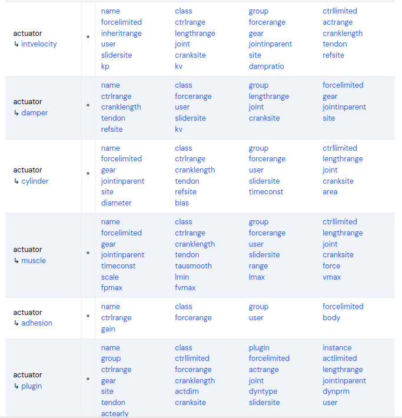

# actuator
<font color=DarkCyan>*actuator 节点包含在 mujoco 节点中*</font>
这是 mujoco中运动控制的节点，在这里指定驱动器，给机器人加入肌肉。

#### general 通用驱动器


&emsp;&emsp;general驱动器类似编程语言中的父对象，后面很多驱动器继承该驱动器的属性，建模的时候不要使用该驱动器。name，class，group
**ctrllimited=[false/true/auto]**
&emsp;&emsp;控制限制，指对驱动器输入值限制，默认 auto
**ctrlrange="0 0"**
&emsp;&emsp;控制范围
**forcelimited==[false/true/auto]**
&emsp;&emsp;驱动器输出力范围
**forcerange="0 0"**
&emsp;&emsp;力范围
**actlimited==[false/true/auto]**
&emsp;&emsp;驱动器活动范围
**actrange="0 0"**
&emsp;&emsp;活动范围，如平面关节为角度范围，默认单位按照设置单位**lengthrange="0 0"**
&emsp;&emsp;活动长度范围，模拟肌肉用到的
**cranklength="0"**
&emsp;&emsp;用于滑块曲柄，设置连杆长度，先建立连杆结构的几何体，之后直接将组合几何体给到 cranksite
**cranksite="string"**
&emsp;&emsp;指定曲柄滑块机构
**gear="100000"**
&emsp;&emsp;对力进行缩放第一个参数有效，其余是joint、
jointinparent和site用的，先不用管
**tendon="string"**
&emsp;&emsp;肌腱，抽象控制器组合，比如双轮同时控制，多个控制器合成一控制输入
**dynprm，gainprm，biasprm**
这些参数都是任意数量
&emsp;&emsp;激活动态参数,表现为阻尼或者响应
&emsp;&emsp;增益参数，表现为映射或者缩放
&emsp;&emsp;偏置参数，零点偏置

#### motor 驱动器
扭矩控制器，和电机差不多，相当于通用驱动器如下设置：
|Attribute	|Setting|	Attribute|	Setting|
|-----------|-------|------------|---------|
|dyntype	|none	|dynprm	|1 0 0|
|gaintype	|fixed	|gainprm	|1 0 0|
|biastype	|none	|biasprm	|0 0 0|

其他属性继承通用驱动器
<font color=Green>*演示：*</font>
`<motorjoint="joint"name="Torque"/>`
<font color=Green>*等效：*</font>
```xml
<general joint="joint" name="Torque" ctrlrange="-1 1" dynprm="1 0 0" gainprm="1 0 0" biasprm="0 0 0"/>
```

#### position 驱动器
位置控制伺服，相当于通用的
|Attribute	|Setting	|Attribute	|Setting|
|-----------|-----------|-----------|-------|
|dyntype	|none or filterexact|	dynprm	|timeconst 0 0|
|gaintype	|fixed	|gainprm	|kp 0 0|
|biastype	|affine	|biasprm	|0 -kp -kv|

**kp=" 0 "（反馈增益，比例，相当于输入*kp）**
**kv=" 0 "**
&emsp;&emsp;阻尼，使用这个建议 option中积分器改成 implicitfast或者implicit
**dampratio=" 0 "**
&emsp;&emsp;阻尼比，加了阻尼才能加这个，计算方式为 2 √(kp*m)，值为 1 对应于临界阻尼振荡器，该振荡器通常会产生理想的行为。小于或大于 1 的值分别对应于欠阻尼和过阻尼振荡。小于或大于 1 的值分别对应于欠阻尼和过阻尼振荡
**timeconst=" 0 "**
&emsp;&emsp;大于 0 为一阶滤波器时间常数，等
于 0 不使用滤波器）。inheritrange（看文档）。
<font color=Green>*演示：*</font>
```xml
<position joint="joint" name="pos" kp=" 2 "kv=" 0. 1 "/>
```

**inheritrange：**
|inheritrange|	ctrlrange|
|------------|-----------|
|0	|手动设置|
|1.0	|和限制的range一致|
|<1.0	|大于限制|
|>1.0	|小于限制|

&emsp;&emsp;非0/1.0时计算公式：

<font color=Green>*演示：*</font>
```xml
<position joint="joint" name="pos" kp="2" kv="0.1" />
```

#### velocity 驱动器
速度伺服控制，等效通用驱动器：
|Attribute|	Setting|	Attribute|	Setting|
|---------|--------|-------------|---------|
|dyntype|	none|	dynprm|	1 0 0|
|gaintype|	fixed	|gainprm|	kv 0 0|
|biastype|	affine|	biasprm|	0 0 -kv|

**kv（速度增益）**
#### intvelocity 驱动器
积分速度伺服：
|Attribute	|Setting|	Attribute|	Setting|
|-----------|-------|------------|---------|
|dyntype	|integrator|	dynprm|	1 0 0|
|gaintype	|fixed|	gainprm|	kp 0 0|
|biastype	|affine|	biasprm|	0 -kp -kv|
|actlimited	|true|		|               |

这里 kp变成速度增益了，kv变为阻尼。
inheritrange同上position

#### damper 驱动器

产生与速度和控制正比的力，建议开建议 option中积分器 implicitfast或者 implicit，
F=-kv*velocity*control,等效：
|Attribute	|Setting|	Attribute|	Setting|
|-----------|-------|------------|---------|
|dyntype	|none	|dynprm	|1 0 0|
|gaintype	|affine|	gainprm|	0 0 -kv|
|biastype	|none	|biasprm|	0 0 0|
|ctrllimited|	true|		||

#### cylinder 驱动器

气缸和液缸模拟：
|Attribute|	Setting|	Attribute|	Setting|
|---------|--------|-------------|---------|
|dyntype|	filter|	dynprm|	timeconst 0 0|
|gaintype|	fixed|	gainprm|	area 0 0|
|biastype|	affine|	biasprm|	bias(3)|

**timeconst=" 1 "（时间常数）**
**area=" 1 "（圆柱体面积，输出增益）**
**diameter=""（指定为直径，比面积优先）**
**bias=" 000 "（偏置）**

<font color=Green>*演示：*</font>
```xml
<actuator>
<position joint="rfd" name="rfdp" kp="2" kv="0.1"/>
<motor joint="rfa" name="rfav"/>
</actuator>
```