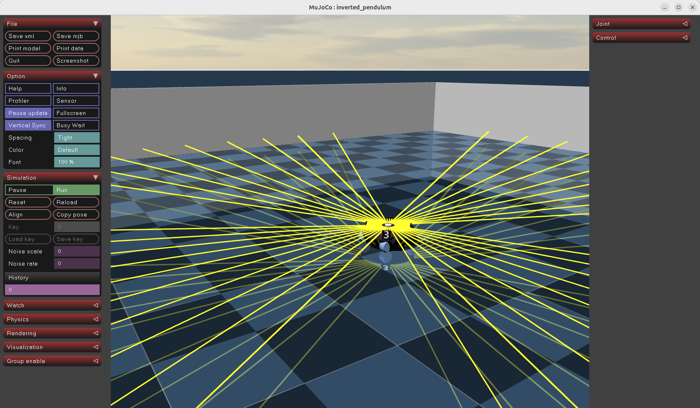
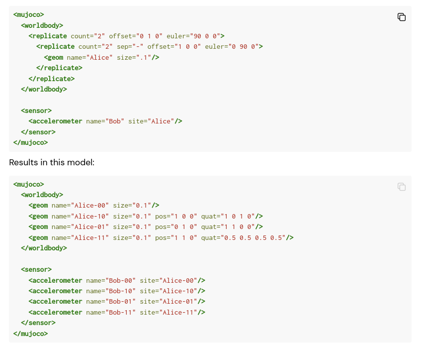

# light 灯光节点


**name=""（用来索引）**  
**mode=[fixed/track/trackcom/targetbody/targetbodycom]**  
&emsp;&emsp;fixed在某处固定光   
&emsp;&emsp;tarck追踪物体的 trackcom几乎差不多      
&emsp;&emsp;targetbody跟着body一起动的      
**target=""**       
&emsp;&emsp;跟踪的目标      
**directional=[false/true]**        
&emsp;&emsp;true是定向的光，就像场一样，定向平行光；false就是聚光灯，和车灯一样     
**castshadow="[true/false]"**       
&emsp;&emsp;照射物体有没有影子      
**active="bool"**       
&emsp;&emsp;是否能控制开关灯**      
**pos="0 0 0"**     
**dir="0 0 0"**     
&emsp;&emsp;方向        
**attenuation="0 0 0"**     
&emsp;&emsp;衰减系数,置 0 和 1 为没有光。[0,1]范围内越大越衰减      
**cutoff="0"**      
&emsp;&emsp;聚光灯截止（最大）角度，角度制      
**exponent="0"**        
&emsp;&emsp;聚光灯汇聚光程度，数值越大光线角度越小      
**ambient="0 0 0"**     
&emsp;&emsp;颜色，亮度也算是这个        
**diffuse="0.7 0.7 0.7"**       
&emsp;&emsp;漫射颜色        
**specular="0.3 0.3 0.3"**      
&emsp;&emsp;反射颜色        
<font color=Green>*定向光演示：*</font>     
```xml
<light directional="true" ambient="111 "pos=" 005 "dir=" 00 - 1 " diffuse=" 111 "specular=" 111 "/>
```
<font color=Green>*车灯演示：*</font>
```xml
<light pos="0.1 0.02" dir="10 0 -1" ambient="1 1 1" cutoff="60" exponent="0" mode="targetbody" diffuse="1 1 1" specular=" 1 1 1"/>
```
<font color=Green>*跟踪物体打光：*</font>
```xml
<light name="light2arm" castshadow="true" mode="targetbody" target="armor0" diffuse="1 0 0" specular="1 0 0" ambient="1 0 0" cutoff="1" exponent="0" pos="2 2 1"/>
```

#  replicate 复制节点（阵列排布）
&emsp;&emsp;mujoco中的阵列排布可以是圆周阵列和直线阵列，就像我们在常见的建模软件中的阵列一样，首先需要一个实体，可以是 body或者是 geom，然后我们要确定圆形，半径，排列数量，相距角度等。        
**count="0"**       
&emsp;&emsp;阵列数量        
**euler="0 0 0"**       
&emsp;&emsp;围绕三个轴阵列，参数为两个实体相隔角度，角度单位为 compiler中定义的     
**sep=""**      
&emsp;&emsp;名字分隔，阵列的实体名字会是原来的 name+编号,如果sep有字符，则是 name+sep+编号      
**offset="0 0 0"**      
&emsp;&emsp;阵列的坐标偏移，前两个是 xy偏移，第三个是阵列的元素在 z方向上的距离间隔，也就是螺旋上升     
<font color=Green>*圆周演示:*</font>
```xml  
<body name="laser" pos="0.25 0.25 0.5">
<geom type="cylinder" size="0.01 0.01"/>
<replicate count="50" euler="0 0 0.1254">
<site name="rf" pos="0.1 0 0" zaxis="1 0 0" size="0.001 0.001 0.001" rgba="0.8 0.2 0.2 1"/>
</replicate>
</body>
```
&emsp;&emsp;这个演示中我们在 body里面圆周阵列了 50 个site，绕 z轴，每个site相隔角度为 0. 1254 pi，阵列半径为site中pos的第一个参数，此时pos不再决定几何体的三维空间位置，而是配合阵列使用。  
<font color=Green>*效果:*</font>    


## 官方文档演示：
    

<font color=Green>*直线阵列演示（不加入 euler就是直线阵列,offset作为排布方向和间距）：*</font>  
```xml
<replicate count="4" offset="0 .5 0">
<geom type="box" size=".1 .1 .1"/>
</replicate>
```