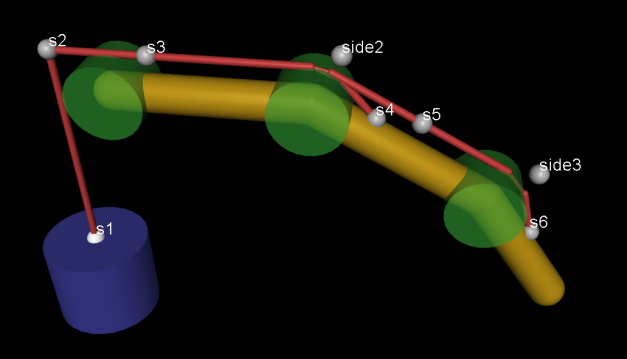

# tendon 肌腱
&emsp;&emsp;肌腱的作用就是将关节组合映射，可以将多个关节组合成一个控制器进行控制。最简单的用法可以看官方模型的 car.xml。这个模型将左轮和右轮统一映射成了向前和旋转两个控制器对车辆进行控制。如果作为麦轮或者全向轮来说可以分成 x,y,roat这三个控制器。       
       
       
&emsp;&emsp;tendon有两种组合模式，一种是spatial一种是 fixed。       

## spatial      
&emsp;&emsp;使用tendon组合关节驱动的时候，要使用tendon下面的spatial节点。spatial是类似一种像肌肉一样的驱动方式，比如线驱灵巧手等。如下图所示的驱动方式，通过每个site来拉住关节驱动。        
       

&emsp;&emsp;spatial包含name.class,group,limited,rgba        
**range="0 0"**     
&emsp;&emsp;肌腱长度范围        
**frictionloss="0"**        
&emsp;&emsp;摩擦损失        
**width="0.003"**       
&emsp;&emsp;肌腱半径，可视化部分           
**stiffness="0"**       
&emsp;&emsp;刚性系数，相当于弹簧的弹力系数      
**damping="0"**     
&emsp;&emsp;阻尼系数。正值会产生沿肌腱作用的阻尼力（速度线性）。与 通过欧拉方法隐式积分的关节阻尼，则肌腱阻尼不是隐式积分的，因此 如果可能，应使用关节阻尼）。      

## fixed   
&emsp;&emsp;使用tendon组合关节映射的时候，要使用tendon下面的fixed节点。fixed中包含关节的映射关系。fixed中joint为制定关节，coed为缩放系数。原理就是使用fixed组合之后，控制器不再使用关节控制，而是将数据传给tendon/fixed，通过code缩放参数后给joint。    

## 肌肉
```xml
    <actuator>
        <muscle name="A" tendon="A" ctrlrange="-15 15"/>
    </actuator>
```
