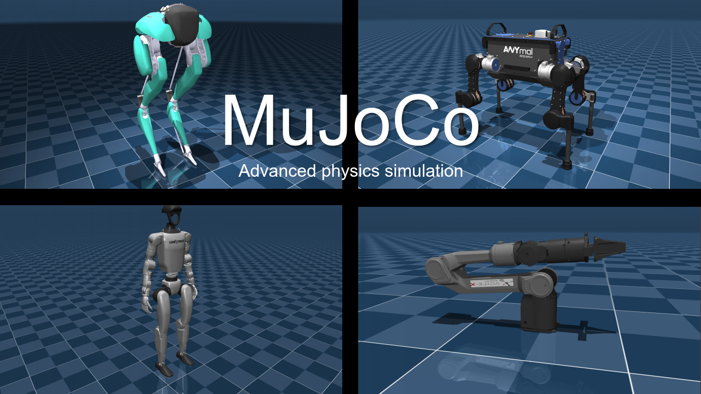

# mujoco教程
MJCF为建模部分
CPP和python均为开发接口
extend为拓展和进阶
## 教程目录（更新中）
### MJCF模型文件
> 第一节   mujoco安装 [install](MJCF/Chapter0-install/tutorial.md)  
> 第二节   仿真世界调整 [virtual_world](MJCF/Chapter2-virtual_world/tutorial.md)  
> - 物理世界参数，可视化配置，材质加载等
> 
> 第三节   仿真世界 [worldbody](MJCF/Chapter3-worldbody/tutorial.md)  
> - 世界body，几何体，地形等
>
> 第四节   关节 [joint](MJCF/Chapter4-joint/tutorial.md)
> - 关节类型，关节动力，关节参数等
>
> 第五节   摩擦力计算方式 [friction](MJCF/Chapter5-friction/tutorial.md)
> 第六节   驱动器 [actuator](MJCF/Chapter6-actuator/tutorial.md)
> - 添加速度控制，位置控制，力矩控制等
>
> 第七节   灯光和复制 [light&replicate](MJCF/Chapter7-light&replicate/tutorial.md)
> - 灯光类型(和相机传感器关联性强)
> - 复制实体，阵列排布，激光雷达演示
>
> 第八节   肌腱 [tendon](MJCF/Chapter8-tendon/tutorial.md)
> - mujoco特有的驱动器和关节联系方式
> - 肌肉控制
>
> 第九节   传感器 [sensor](MJCF/Chapter9-sensor/tutorial.md)
> - 相机传感器，imu,速度，角度等
>
> 第十节   从CAD软件制作mjcf模型 [from_CAD_software](MJCF/Chapter10-from_CAD_software/tutorial.md)
> - 以solidworks为例
>
> 第十一节   约束条件 [equality](MJCF/Chapter11-equality/tutorial.md)
> - 并联机构建模，驱动跟踪等
>
> 第十二节   默认属性设置 [default](MJCF/Chapter12-default/tutorial.md)
> - 几何体，body，关节等默认参数
>
> 第十三节   可变形体（老版3.2.7及以前） [composite](MJCF/Chapter13-composite/tutorial.md)
> - 绳子，布料，软体等
>
> 第十四节   可变形体（新版3.3.0及以后） [flex](MJCF/Chapter14-flex/tutorial.md)
> - 柔性材料，布料，软体，绳索，从网格构建可变形模型等
>
> 第十五节   关节帧 [keyframe](MJCF/Chapter15-keyframe/tutorial.md)
> - 加载和储存特定的姿态，关节信息等
### API
> 第一节   编译 
> - 编译环境，编译命令，编译开发演示
> > [make(C++)](CPP/Chapter1-make/tutorial.md)
>
> 第二节   可视化和仿真进行 
> - 仿真环境，可视化，仿真步进，仿真步进控制等
> > [view&step(C++)](CPP/Chapter2-view&step/tutorial.md)
> > [view&step(Python)](Python/Chapter1-view&step/tutorial.md)
>
> 第三节   获取仿真世界中的实体信息 
> - 获取仿真世界中的实体信息，如名字，数量，参数信息等
> > [get_obj(C++)](CPP/Chapter3-get_obj/tutorial.md)
> > [get_obj(Python)](Python/Chapter2-get_obj/tutorial.md)
>
> 第四节   传感器数据获取 
> - 获取仿真世界中的传感器数据，如相机，imu，速度，角度等
> > [sensor_data(C++)](CPP/Chapter4-sensor_data/tutorial.md)
> > [sensor_data(Python)](Python/Chapter3-sensor_data/tutorial.md)
>
> 第五节   2D和3D绘制 
> - 2D绘制：文字，方形，表格等
> - 3D绘制：基础几何体，箭头等
> > [draw(C++)](CPP/Chapter5-draw/tutorial.md)
> > [draw(Python)](Python/Chapter4-draw/tutorial.md)
>
> 第六节   力的计算和API验证 
> - mujoco中力是如何作用的及验证
> > [force(C++)](CPP/Chapter6-force/tutorial.md)
> > [force(Python)](Python/Chapter5-force/tutorial.md)
>
> 第七节   渲染配置 
> - 双目相机，图像分割，渲染配置等
> > [vis_cfg(C++)](CPP/Chapter7-vis_cfg/tutorial.md)
> > [vis_cfg(Python)](Python/Chapter6-vis_cfg/tutorial.md)
>
> 第八节   射线测距 
> - 测距传感器实现原理，自定义测距
> > [ray(C++)](CPP/Chapter8-ray/tutorial.md)
> > [ray(Python)](Python/Chapter7-ray/tutorial.md)

### 拓展和进阶
> 一、 触觉检测
> - 刚性触摸板和柔性材料触觉检测，通过api实现，并非插件方式
> > [touch(C++&Python)](extend/touch/readme.md)

## 视频教程
>[视频教程链接](https://www.bilibili.com/video/BV1wMdHYVEnx/?spm_id_from=333.1387.collection.video_card.click&vd_source=71e0e4952bb37bdc39eaabd9c08be754)
## 教程封面

## 技术交流

