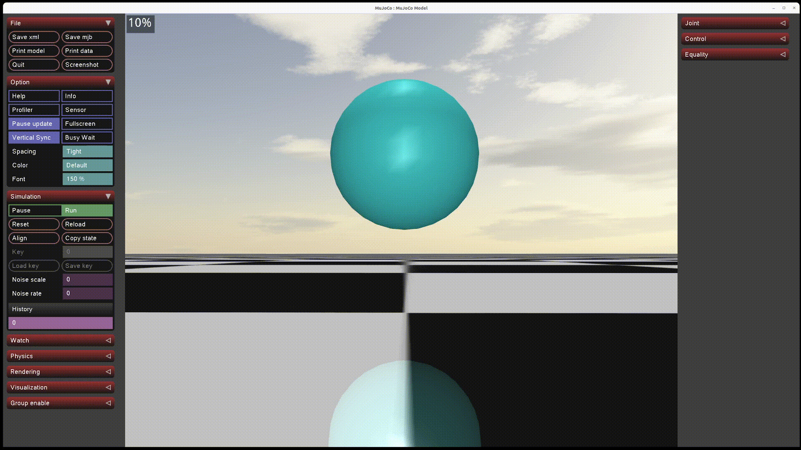
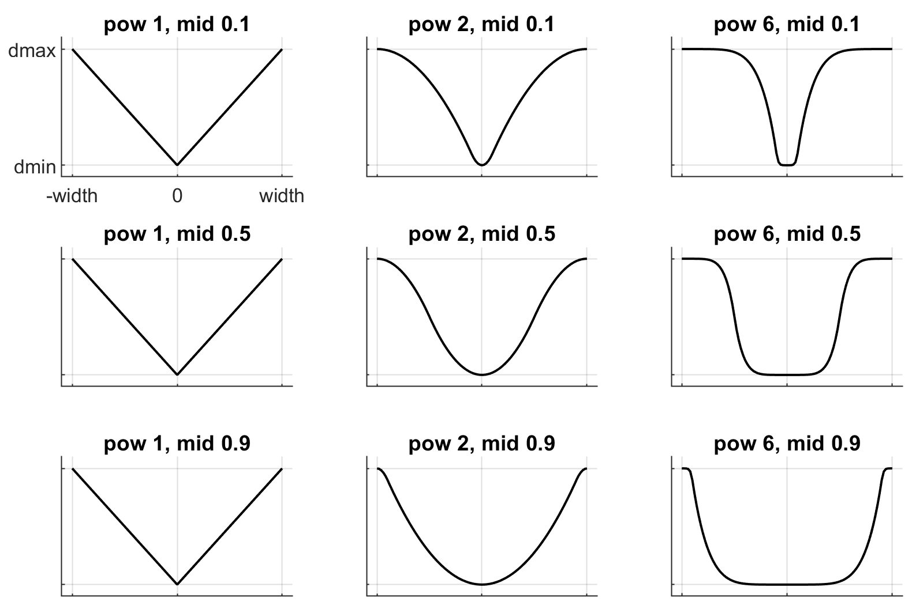
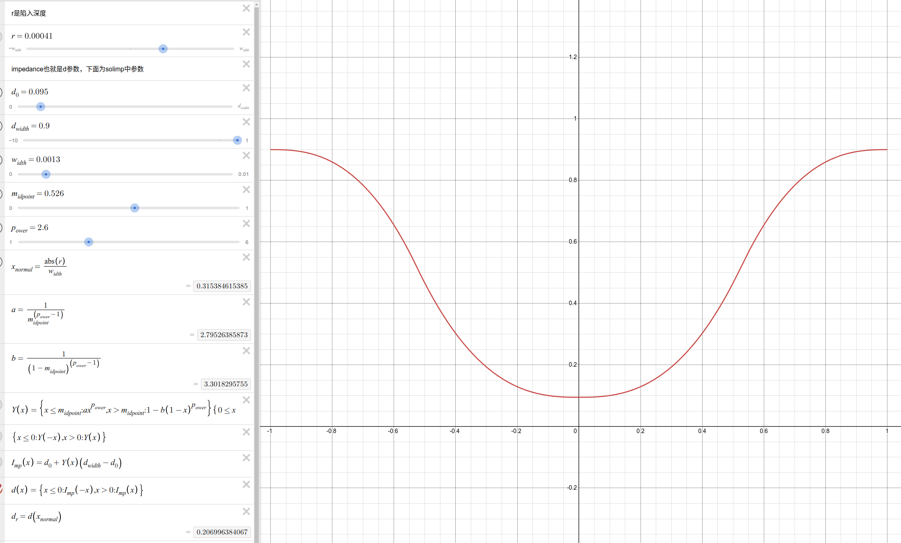
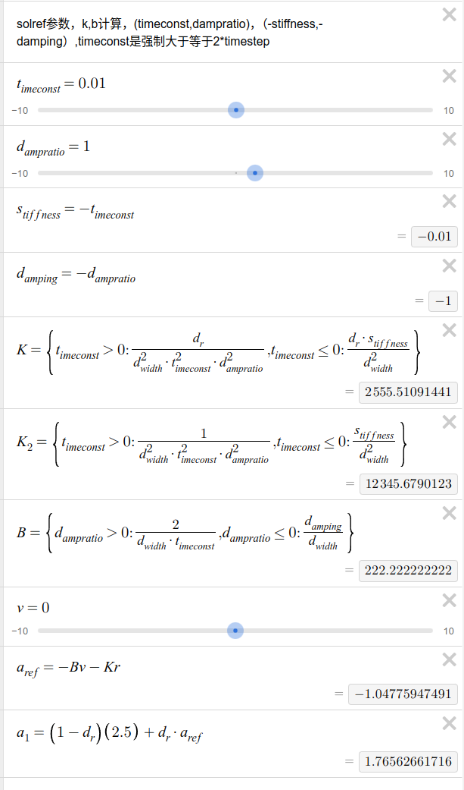

# Soft Contact
***&emsp;&emsp;软接触由geom中的solimp和solref参数调控***
&emsp;&emsp;虽然geom在mujoco中是刚体，但是通过soft contact可以近似现实中物体碰撞时发生的形变，比如刚性比较强的物体发生的微小变形，又或者是一个可以通过缓冲力的物体，又或者是一个很有弹性的橡皮球，这些在mujoco的刚体中可以通过soft contact近似出这些物体的碰撞情况       
       

| 属性名称 | 参数类型 | 默认值 | 物理含义 (正数格式) | 物理含义 (负数格式) |
| :--- | :--- | :--- | :--- | :--- |
| **`solref`** | `mjtNum[2]` | `0.02, 1.0` | `(timeconst, dampratio)`<br>• `timeconst`: 时间常数，控制回弹反应速度<br>• `dampratio`: 阻尼比，控制回弹振荡幅度（1 为临界阻尼） | `(-stiffness, -damping)`<br>• `stiffness`: 直接指定虚拟弹簧刚度 $k$<br>• `damping`: 直接指定虚拟弹簧阻尼 $b$ |
| **`solimp`** | `mjtNum[5]` | `0.9, 0.95, 0.001, 0.5, 2` | `(dmin, dmax, width, midpoint, power)`<br>• `dmin`: 阻抗的最小值<br>• `dmax`: 阻抗的最大值<br>• `width`: 过渡区域的穿透深度宽度<br>• `midpoint`: 分段过渡曲线的分界点 (0 到 1 之间)<br>• `power`: 曲线的幂次 | - |

[公式计算可视化（desmos）](https://www.desmos.com/calculator/irtgrwjpkb?lang=zh-CN)         

<div id="solver-visualizer-container" class="solver-visualizer-card">
  <h3>MuJoCo 接触解算参数实时可视化工具</h3>
  <div class="visualizer-layout">
    <div class="canvas-panel">
      <canvas id="solver-canvas" style="width: 100%; height: 260px;"></canvas>
      <div class="plot-legend">
        <span class="legend-item"><span class="color-box d-curve"></span>d(r) - 阻抗</span>
        <span class="legend-item"><span class="color-box k-curve"></span>k(r) - 相对刚度</span>
        <span class="legend-item"><span class="color-box b-curve"></span>b(r) - 相对阻尼</span>
      </div>
    </div>
    <div class="controls-panel">
      <div class="control-group">
        <label>预设模式 (Presets):</label>
        <select id="preset-select">
          <option value="custom">自定义 (Custom)</option>
          <option value="rubber">橡胶球 (Rubber Ball)</option>
          <option value="metal">牛顿摆/金属 (Newton Cradle)</option>
          <option value="cushion">缓冲垫 (Cushioning)</option>
        </select>
      </div>

      <div class="tab-container">
        <button class="tab-btn active" onclick="switchTab('imp')">solimp 阻抗曲线</button>
        <button class="tab-btn" onclick="switchTab('ref')">solref 回弹参考</button>
      </div>

      <!-- solimp parameters -->
      <div id="imp-controls" class="tab-content active">
        <div class="slider-item">
          <label>dmin (d₀): <span id="val-d0">0.9</span></label>
          <input type="range" id="param-d0" min="0" max="1" step="0.01" value="0.9">
        </div>
        <div class="slider-item">
          <label>dmax (dwidth): <span id="val-dwidth">0.95</span></label>
          <input type="range" id="param-dwidth" min="0.0001" max="0.9999" step="0.01" value="0.95">
        </div>
        <div class="slider-item">
          <label>width: <span id="val-width">0.001</span></label>
          <input type="range" id="param-width" min="0.0001" max="0.01" step="0.0001" value="0.001">
        </div>
        <div class="slider-item">
          <label>midpoint: <span id="val-midpoint">0.5</span></label>
          <input type="range" id="param-midpoint" min="0.01" max="0.99" step="0.01" value="0.5">
        </div>
        <div class="slider-item">
          <label>power: <span id="val-power">2</span></label>
          <input type="range" id="param-power" min="1" max="10" step="0.5" value="2">
        </div>
      </div>

      <!-- solref parameters -->
      <div id="ref-controls" class="tab-content">
        <div class="control-group">
          <label>参考格式 (Format):</label>
          <select id="ref-format-select">
            <option value="standard">标准 (timeconst, dampratio)</option>
            <option value="direct">直接 (stiffness, damping)</option>
          </select>
        </div>
        <div id="standard-ref-inputs" style="display: flex; flex-direction: column; gap: 14px;">
          <div class="slider-item">
            <label>timeconst (τ): <span id="val-timeconst">0.02</span>s</label>
            <input type="range" id="param-timeconst" min="0.001" max="0.1" step="0.001" value="0.02">
          </div>
          <div class="slider-item">
            <label>dampratio (ζ): <span id="val-dampratio">1.0</span></label>
            <input type="range" id="param-dampratio" min="0.1" max="5.0" step="0.1" value="1.0">
          </div>
        </div>
        <div id="direct-ref-inputs" style="display: none; flex-direction: column; gap: 14px;">
          <div class="slider-item">
            <label>stiffness (k): <span id="val-stiffness">1000</span></label>
            <input type="range" id="param-stiffness" min="10" max="10000" step="10" value="1000">
          </div>
          <div class="slider-item">
            <label>damping (b): <span id="val-damping">10</span></label>
            <input type="range" id="param-damping" min="1" max="500" step="1" value="10">
          </div>
        </div>
      </div>
    </div>
  </div>
</div>

**在这里把碰撞拆解成了下面公式**          
$$a_{ref}=-bv-kr$$      
$$a_{1}=(1-d) \cdot a_{0}-d \cdot a_{ref}$$     
> a1:计算之后的加速度
> a0:无约束时的加速度
> v :速度
> r :陷入深度，两个物体间碰撞会陷入一段距离
> d,b,k:约束参数，solimp和solref计算结果

**这就是一个动态的“弹簧-阻尼”模型，a<sub>ref</sub>是一个“弹簧-阻尼“，陷入深入r越大a<sub>ref</sub>权重越高，约束力越强”**        

## solimp参数       
**solimp这个参数会计算出来上述公式中的d，这个d的计算会和两个物体碰撞时陷入的深度有关，d的范围是(0,1)。下面参数会计算出来d(r)**
> 参数：(d<sub>0</sub>,d<sub>width</sub>,width,midpoint,power)
>- d<sub>0</sub>：d的最小值
>- d<sub>width</sub>：d的最大值
>- width：陷入深度归一化的底数，归一化计算：normal(r)/width
>- midpoint：控制d变化曲线,会使曲线底部变“宽”，曲线分段位置
>- power：控制d变化曲线，会使曲线变化的“更快”

**计算公式**        
$$x_{\text{normal}} = \frac{|r|}{\text{width}}$$        
$$a = \frac{1}{\text{midpoint}^{\text{power}-1}}$$      
$$b = \frac{1}{(1 - \text{midpoint})^{\text{power}-1}}$$        

$$Y(x) = \{
\begin{array}{ll}
a x^{power} & \text{if } x \leq midpoint \\
1 - b (1 - x)^{power} & \text{if } x > midpoint
\end{array}
\}
\quad \text{for} \quad \{ 0 \leq x \leq 1 \}$$      

$$d\left(x_{normal}\right) = d_{0} + Y\left(x_{normal}\right) \left( d_{\text{width}} - d_{0} \right)$$     

**官方文档图像**        
         
[**desmos绘制**](https://www.desmos.com/calculator/irtgrwjpkb?lang=zh-CN)       
        
**源码位置**        
engine/engine_core_constraint.c:        
static void getimpedance(const mjtNum* solimp, mjtNum pos, mjtNum margin,mjtNum* imp, mjtNum* impP)     
```c
static void getimpedance(const mjtNum* solimp, mjtNum pos, mjtNum margin, mjtNum* imp, mjtNum* impP) {
  // flat function
  if (solimp[0] == solimp[1] || solimp[2] <= mjMINVAL) {
    *imp = 0.5*(solimp[0] + solimp[1]);
    *impP = 0;
    return;
  }

  // x = abs((pos-margin) / width)
  mjtNum x = (pos-margin) / solimp[2];
  mjtNum sgn = 1;
  if (x < 0) {
    x = -x;
    sgn = -1;
  }

  // clamp x to [0, 1]
  if (x >= 1) {
    *imp = solimp[1];
    *impP = 0;
    return;
  }

  // linear or power transition
  mjtNum y, yP;
  if (solimp[4] == 1) {
    y = x;
    yP = 1;
  }
  // y(x) = a*x^p if x<=midpoint
  else if (x <= solimp[3]) {
    mjtNum a = 1 / mju_pow(solimp[3], solimp[4]-1);
    y = a * mju_pow(x, solimp[4]);
    yP = solimp[4] * a * mju_pow(x, solimp[4]-1);
  }
  // y(x) = 1-b*(1-x)^p if x>midpoint
  else {
    mjtNum b = 1 / mju_pow(1-solimp[3], solimp[4]-1);
    y = 1 - b * mju_pow(1-x, solimp[4]);
    yP = solimp[4] * b * mju_pow(1-x, solimp[4]-1);
  }

  // scale
  *imp = solimp[0] + y*(solimp[1]-solimp[0]);
  *impP = yP * sgn * (solimp[1]-solimp[0]) / solimp[2];
}
```

## solref参数       
**这个参数影响公式中的k,b**     

> 参数为正值(timeconst,dampratio)
>- timeconst：会影响k,b，数值越小k,b越大，但不会小于两倍的timestep（强制性的）
>- dampratio：会影响k,数值越小k越大，一般设置为1,数值过小会阻尼不够或弹性不足，数值过大会约束过过度

**计算公式**        
$$b=\frac{2}{d_{width} \cdot timeconst}$$       
$$k=\frac{d(r)}{d_{width} \cdot timeconst^2 \cdot dampratio^2}$$        

> 参数为负值(-stiffness,-damping)
>- stiffness：与d<sub>width</sub>一起影响k值
>- damping：与d，d<sub>width</sub>一起影响b值

**计算公式**        
$$b=\frac{damping}{d_{width}}$$     
$$k=\frac{stiffness \cdot d(r)}{d_{width}^2}$$      

[**desmos**](https://www.desmos.com/calculator/irtgrwjpkb?lang=zh-CN)       
     
**源码位置**        
engine/engine_core_constraint.c:        
void mj_makeImpedance(const mjModel* m, mjData* d)      
```c
// ... inside mj_makeImpedance
// set R and KBIP for all constraint dimensions
for (int j=0; j < dim; j++) {
    // ...
    // friction: K = 0
    if (tp == mjCNSTR_FRICTION_DOF || tp == mjCNSTR_FRICTION_TENDON || elliptic_friction) {
        KBIP[4*(i+j)] = 0;
    }
    // standard: K = 1 / (d_width^2 * timeconst^2 * dampratio^2)
    else if (ref[0] > 0) {
        KBIP[4*(i+j)] = 1 / mju_max(mjMINVAL, solimp[1]*solimp[1] * ref[0]*ref[0] * ref[1]*ref[1]);
    }
    // direct: K = -solref[0] / d_width^2
    else {
        KBIP[4*(i+j)] = -ref[0] / mju_max(mjMINVAL, solimp[1]*solimp[1]);
    }

    // standard: B = 2 / (d_width*timeconst)
    if (ref[1] > 0) {
        KBIP[4*(i+j)+1] = 2 / mju_max(mjMINVAL, solimp[1]*ref[0]);
    }
    // direct: B = -solref[1] / d_width
    else {
        KBIP[4*(i+j)+1] = -ref[1] / mju_max(mjMINVAL, solimp[1]);
    }
    
    // I = imp, P = imp'
    KBIP[4*(i+j)+2] = imp;
    KBIP[4*(i+j)+3] = impP;
}
```

## solimp和solref的混合规则         
> 情况一：根据priority的大小，选择两个碰撞geom中priority大的solimp和solref参数     
> 情况二：如果priority相同则根据两个geom的solmix参数计算一个mix值，为各自solmix占两个solmix和的比例
>* 两个geom的solmix均大于0，mix=mix = solmix1 / (solmix1 + solmix2)
>* 又任意一方的solmix小于等于0,则使用对方的参数
   
源码位置：engine/engine_collision_driver.c: 
mj_contactParam         
```c
// compute solver mix factor
mjtNum mix;
if (solmix1 >= mjMINVAL && solmix2 >= mjMINVAL) {
    mix = solmix1 / (solmix1 + solmix2);
} else if (solmix1 < mjMINVAL && solmix2 < mjMINVAL) {
    mix = 0.5;
} else if (solmix1 < mjMINVAL) {
    mix = 0.0;
} else {
    mix = 1.0;
}

// reference standard: mix
if (solref1[0] > 0 && solref2[0] > 0) {
    for (int i=0; i < mjNREF; i++) {
        solref[i] = mix*solref1[i] + (1-mix)*solref2[i];
    }
}
// reference direct: min
else {
    for (int i=0; i < mjNREF; i++) {
        solref[i] = mju_min(solref1[i], solref2[i]);
    }
}
```

## 调整思路             
**可以从pd控制器和碰撞曲线两个方面分析碰撞**        
### PD          
$$a_{ref}=-bv-kr$$          
由这个公式可以分析出，如果我们想抑制陷入深度（穿模），那需要增大刚度k的参数，如果碰撞弹性很大或者是接触时抖动剧烈，可能是阻尼b不够      
### 碰撞曲线    
碰撞曲线计算出d参数，会根据陷入深度动态调节pd控制器的比例        

### 例子        
**橡胶材料(RubberBalls)**           
它们的弹性形变量可以很大，那可以调大width参数           
- **如果想要橡胶硬一点**首先增加pd的刚度，其次形变恢复速度要快可以调整曲线让曲线更抖一些(小形变时pd控制器的占比也会比较高)，那就可以增加    d<sub>0</sub>并减小midpoint和power      
- **如果想要橡胶柔一点**，那就是降低刚度，并让曲线缓一点和上述相反      

**金属材料(newton_cradle)**，金属材料的弹性型变量一般比较小，刚性很强，那么width参数就要小一些，刚度k要大一些。然后金属之间碰撞时间会很短，所以碰撞曲线就要变化小，舒缓一些，所以可以d<sub>0</sub>=0,d<sub>width</sub>也要比较小，这样的曲线就很近似短时间碰撞情况      

**缓冲能力较强材料(cushioning)**        
从比较高空落地不怎么反弹，静止时也不会有很大的形变，可以在增加刚度k的同时增加阻尼b      


## 参考
[Computation/Soft contact model](https://mujoco.readthedocs.io/en/latest/computation/index.html#soft-contact-model)
[Modeling/Solver parameters](https://mujoco.readthedocs.io/en/latest/modeling.html#solver-parameters)
