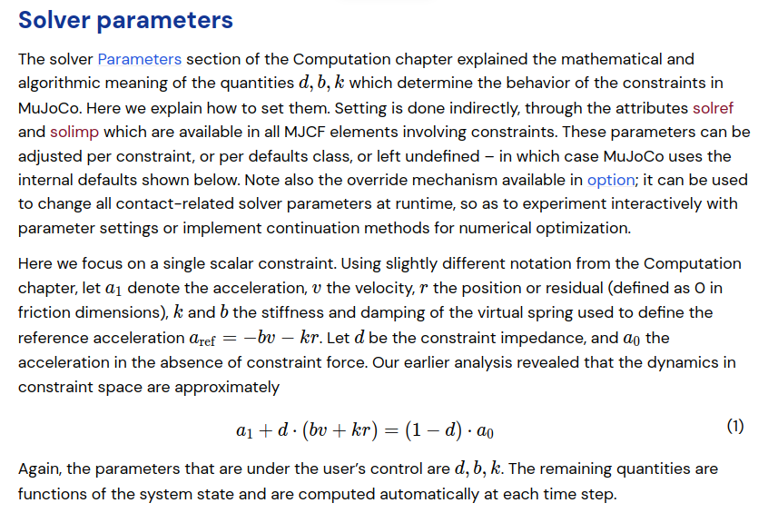
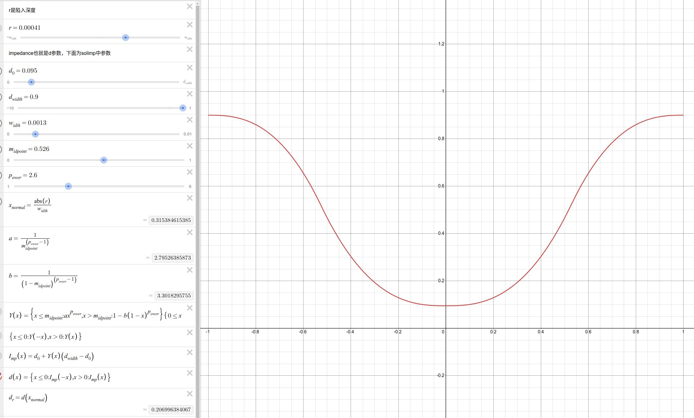
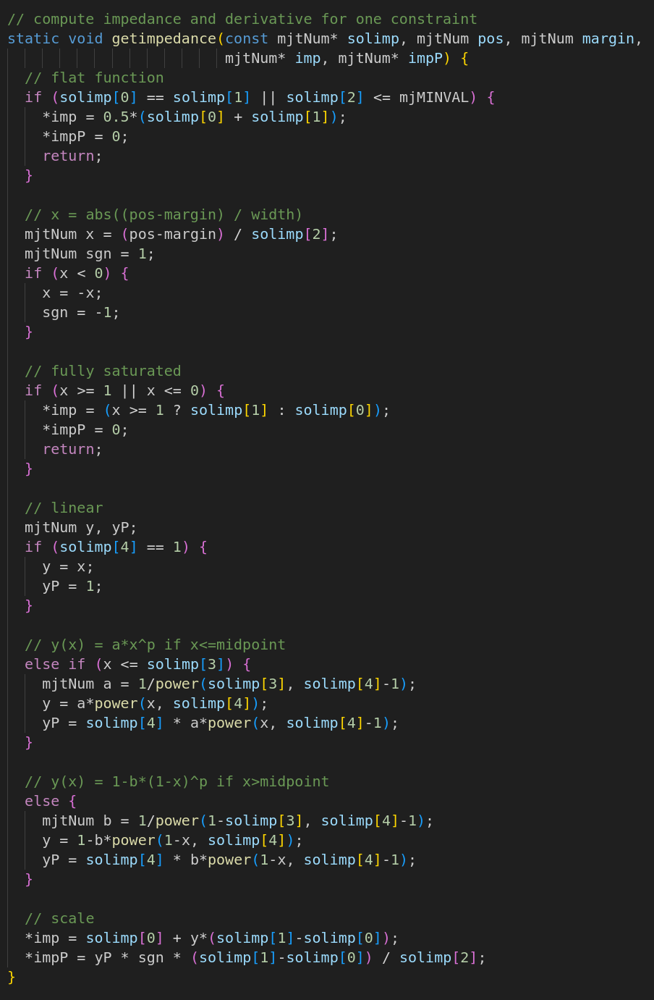
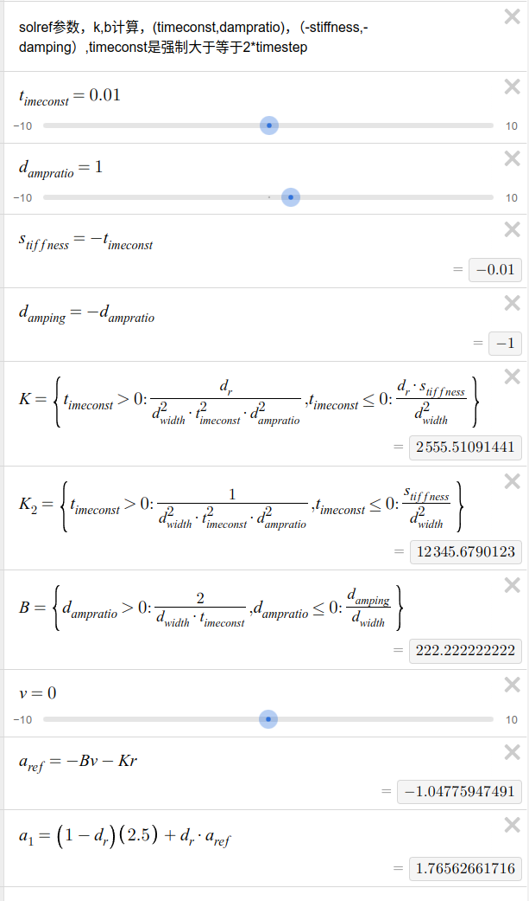
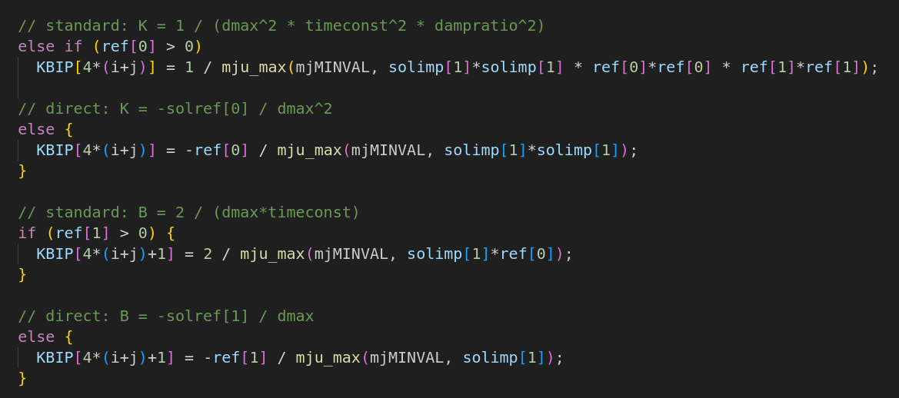

# solimp&solref
     
[公式计算可视化（desmos）](https://www.desmos.com/calculator/irtgrwjpkb?lang=zh-CN)         
**在这里把碰撞拆解成了下面公式**          
$$a_{ref}=-bv-kr$$      
$$a_{1}=(1-d) \cdot a_{0}-d \cdot a_{ref}$$     
> a1:计算之后的加速度
> a0:无约束时的加速度
> v :速度
> r :陷入深度，两个物体间碰撞会陷入一段距离
> d,b,k:约束参数，solimp和solref计算结果

**这就是一个动态的“弹簧-阻尼”模型，aref是一个“弹簧-阻尼“，陷入深入r越大aref权重越高，约束力越强”**        

## solimp       
**solimp这个参数会计算出来上述公式中的d，这个d的计算会和两个物体碰撞时陷入的深度有关，d的范围是(0,1)。下面参数会计算出来d(r)**
> 参数：(d0,dwidth,width,midpoint,power)
>- d0：d的最小值
>- dwidth：d的最大值
>- width：陷入深度归一化的底数，归一化计算：normal(r)/width
>- midpoint：控制d变化曲线,会使曲线底部变“宽”，曲线分段位置
>- power：控制d变化曲线，会使曲线变化的“更快”

**计算公式**        
$$x_{\text{normal}} = \frac{|r|}{\text{width}}$$        
$$a = \frac{1}{\text{midpoint}^{\text{power}-1}}$$      
$$b = \frac{1}{(1 - \text{midpoint})^{\text{power}-1}}$$        

$$Y(x) = \{
\begin{array}{ll}
a x^{p_{ower}} & \text{if } x \leq m_{idpoint} \\
1 - b (1 - x)^{p_{ower}} & \text{if } x > m_{idpoint}
\end{array}
\}
\quad \text{for} \quad \{ 0 \leq x \leq 1 \}$$      

$$d\left(x_{normal}\right) = d_{0} + Y\left(x_{normal}\right) \left( d_{\text{width}} - d_{0} \right)$$     

[**desmos**](https://www.desmos.com/calculator/irtgrwjpkb?lang=zh-CN)       
        
**源码位置**        
engine/engine_core_constraint.c:        
static void getimpedance(const mjtNum* solimp, mjtNum pos, mjtNum margin,mjtNum* imp, mjtNum* impP)     
        

## solref       
**这个参数影响公式中的k,b**     

> 参数为正值(timeconst,dampratio)
>- timeconst：会影响k,b，数值越小k,b越大，但不会小于两倍的timestep（强制性的）
>- dampratio：会影响k,数值越小k越大，一般设置为1,数值过小会阻尼不够或弹性不足，数值过大会约束过过度

**计算公式**        
$$b=\frac{2}{d_{width} \cdot timeconst}$$       
$$k=\frac{d(r)}{d_{width} \cdot timeconst^2 \cdot dampratio^2}$$        

> 参数为负值(-stiffness,-damping)
>- stiffness：与dwidth一起影响k值
>- damping：与d，dwidth一起影响b值

**计算公式**        
$$b=\frac{damping}{d_{width}}$$     
$$k=\frac{stiffness \cdot d(r)}{d_{width}^2}$$      

[**desmos**](https://www.desmos.com/calculator/irtgrwjpkb?lang=zh-CN)       
     
**源码位置**        
engine/engine_core_constraint.c:        
void mj_makeImpedance(const mjModel* m, mjData* d)      
       
      